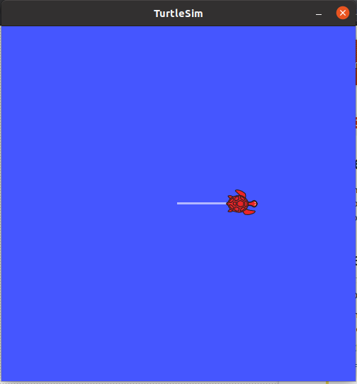

# Move_turtle_in_ROS

This is very beginner level project in ROS. Yet very important to kickstart ROS. We will create ROS node to move turtle in turtlesim simulation (Turtlesim is already installed with ROS). 

Just copy turtle_sim  into your catkin_ws/src folder and run the following commands into the terminal.

## Steps to follow
1. First of all start the ROSMaster node 

   #### roscore

2. Launch the Turtlesim simulation

   #### rosrun  turtlesim turtlesim_node

3. Run the rosnode on turtlesim to move turtle straight or circular

   #### rosrun turtle_sim move_straight.py a b 
   Change a and b by any value. a and b represents the linear and angular velocity given to turtle respectively. 
   
4. To move turtle at particular distance
   
   #### rosrun turtle_sim move_to_dist.py a b c
   where c represent the distance.
   
The Output looks like:

